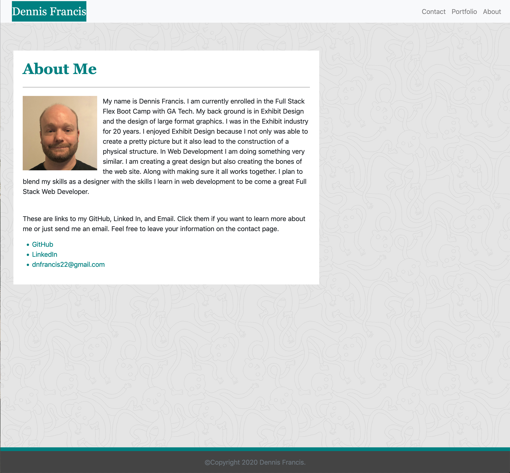

# responsive-portfolio

**Description**

This is a site that I created to display information about my self. There are three pages. About Me, Portfolio, and Contact page. The About Me page is where I have a short biography about my self. I also share links to my LinkedIn site, GitHub and my email address. The Portfolio page currently has place holder images, however it is a place where I can display future projects. The last page is the Contact page. There are input boxes for name and email as well as an input box for a short message.

I made the site responsive so that the site can easily be viewed on mobile devices as well as desktop displays.

**Installation**

Click on the settings tab.
Scroll down to the section that says GitHub Pages.
Click on the link in the green box next to "your site is published at".

Or you can just click here: https://dnfrancis22.github.io/responsive-portfolio/

**Usage**

Located in the nav bar are links. Portfolio, Contact, and About. I f you click on the links they will take you to their specific pages. For example if you click on the Portfolio link it will take you to the portfolio page.

If you click on the Contact link it will take you to the contact page.

On the contact page you can enter your information in the form fields and click on the submit button.

On any of the pages, if you click on my name in the top left corner it will take you back to the about page.

On the about page you can click on any of the links provided. They will take you to either my LinkedIn site, GitHub or allow you to send me an email.

If you grab the side of the browser window and drag to the side to shrink the window to its smallest viewing size you can see the site as if you were viewing it on a smaller device such as a phone or tablet.

**License**

MIT License

Copyright (c) [2020] [Dennis Francis]

Permission is hereby granted, free of charge, to any person obtaining a copy
of this software and associated documentation files (the "Software"), to deal
in the Software without restriction, including without limitation the rights
to use, copy, modify, merge, publish, distribute, sublicense, and/or sell
copies of the Software, and to permit persons to whom the Software is
furnished to do so, subject to the following conditions:

The above copyright notice and this permission notice shall be included in all
copies or substantial portions of the Software.

THE SOFTWARE IS PROVIDED "AS IS", WITHOUT WARRANTY OF ANY KIND, EXPRESS OR
IMPLIED, INCLUDING BUT NOT LIMITED TO THE WARRANTIES OF MERCHANTABILITY,
FITNESS FOR A PARTICULAR PURPOSE AND NONINFRINGEMENT. IN NO EVENT SHALL THE
AUTHORS OR COPYRIGHT HOLDERS BE LIABLE FOR ANY CLAIM, DAMAGES OR OTHER
LIABILITY, WHETHER IN AN ACTION OF CONTRACT, TORT OR OTHERWISE, ARISING FROM,
OUT OF OR IN CONNECTION WITH THE SOFTWARE OR THE USE OR OTHER DEALINGS IN THE
SOFTWARE.

